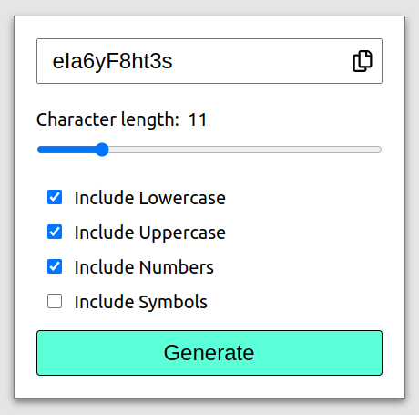

# Secure Password Generator

This project is a secure password generator built with React, TypeScript, and Vite. The application allows users to generate passwords with customizable options such as including lowercase letters, uppercase letters, numbers, and symbols. It also features a copy-to-clipboard functionality and a responsive UI.



## Features

- Generate secure passwords with customizable criteria.
- Copy generated passwords to the clipboard.
- Responsive design for a seamless experience on different devices.
- Built with React, TypeScript, and Vite for fast development and excellent performance.

## Getting Started

### Prerequisites

Ensure you have the following installed:

- Node.js (version 14 or higher)
- Yarn (or npm)

### Installation

1. Clone the repository:

   ```bash
   git clone https://github.com/m-abozaid/secure-password-generator.git
   cd secure-password-generator
   ```

2. Install the dependencies:

   ```bash
   yarn install
   ```

### Running the Application

To start the development server with hot module replacement:

```bash
yarn dev
```

This will start the application on `http://localhost:3000`.

### Building for Production

To build the project for production:

```bash
yarn build
```

This will generate the optimized production build in the `dist` directory.

### Running Tests

To run the test suite:

```bash
yarn test
```

The tests are configured using Jest and React Testing Library, ensuring the application functions as expected.

## Scripts

Here are some useful scripts you can use in the project:

- `yarn dev`: Starts the development server.
- `yarn build`: Builds the application for production.
- `yarn test`: Runs the test suite.
- `yarn lint`: Lints the code using ESLint.
- `yarn preview`: Previews the production build locally.

## License

This project is licensed under the MIT License.
